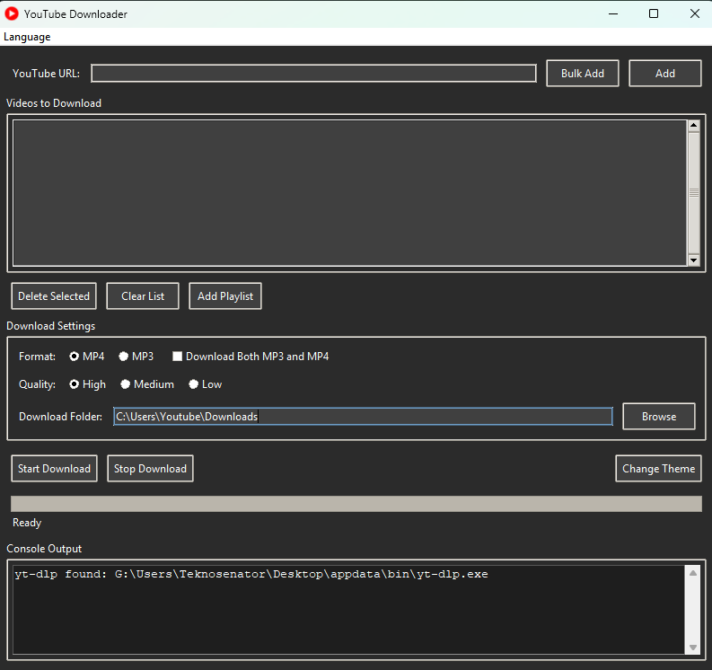

# YouTube Downloader

YouTube Downloader is a powerful application for downloading YouTube videos in MP4 and MP3 formats. It features a modern GUI, multi-language support, and single-executable packaging for easy distribution.

 

## Getting Started

To build the application from source:
1. Open PowerShell in the project root directory.
2. Run:
   ```powershell
   .\derle.ps1
   ```
   This will generate a single-file executable in the `dist/` folder.

To run the pre-built executable:
- Double-click `YouTube_Downloader.exe` in the project root directory or inside `dist/`.


Made in Turkey 🇹🇷

Developed by Digital Aksiyon Merkezi
Contact: dijitalaksiyonmerkezi@gmail.com
GitHub: https://github.com/aksiyoner


## License

This project is licensed under the MIT License - see the [LICENSE](LICENSE) file for details.